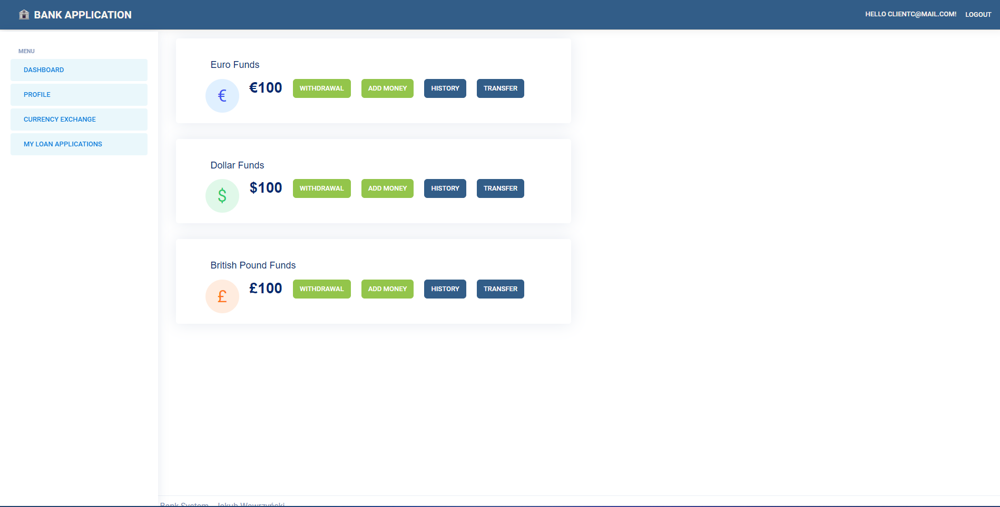
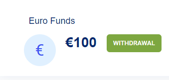
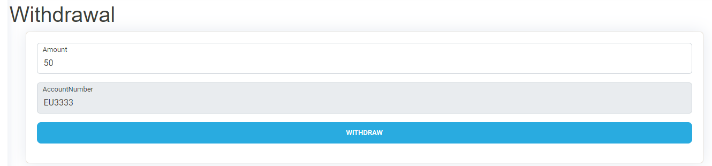
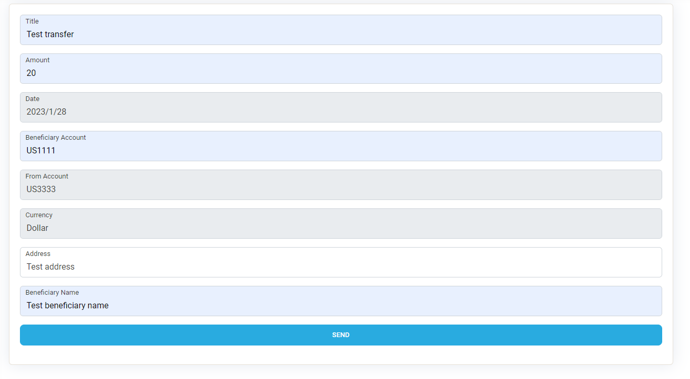
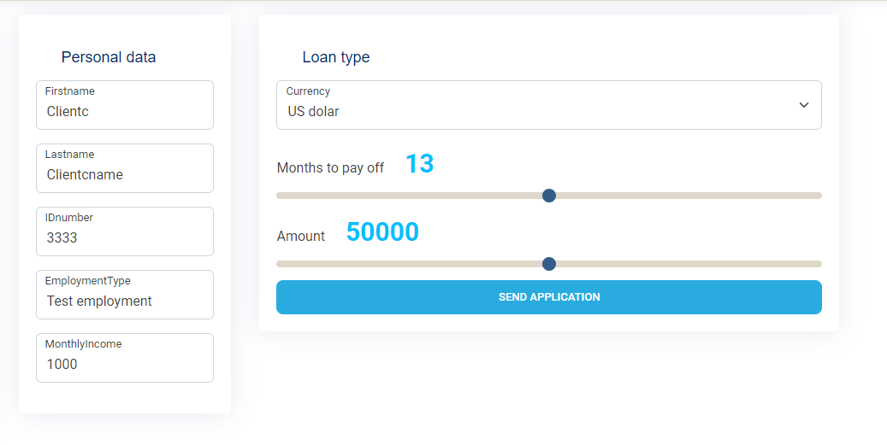
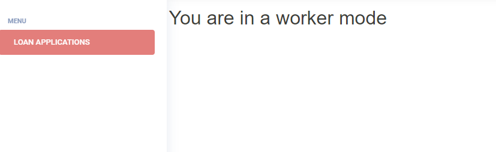
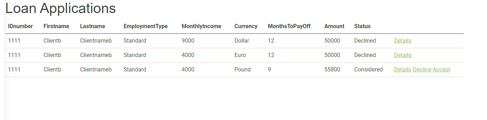

  <h1>BANK APPLICATION</h1>
  <h4 align="center">ASP.NET MVC application with simple bank features</h4>
  

 

▶️ TABLE OF CONTENTS

  <ol>
    <li>
      <a href="gettingstarted">Getting started</a>
    </li>
    <li>
      <a href="mainview">Main View</a>
      <ul type="a">
        <li>
            <a href="withdrawaldeposit">Withdrawal and Deposit</a>
        </li>
        <li>
            <a href="transferhistory">Transfer and history</a>
        </li>
        <li>
            <a href="loanapplications">My loan applications</a>
        </li>
      </ul>
    </li>
    <li>
      <a href="workermode">Worker mode</a>
      <ul type="a">
        <li>
            <a href="workerview">Main worker view</a>
        </li>
        <li>
            <a href="listofloanapplications">List of loan applications</a>
        </li>
      </ul>
    </li>
  </ol>
 

## Getting Started

<ol>
  <li>
    <h4>In appsettings.json file, you need to change: "DefaultConnection": "[your Sql Server connection string]"</h4>
  </li>
  <li>
    <h4>In Data/ApplicationDbContext.cs in OnConfiguring method, you need to change:  
        optionsBuilder.UseSqlServer("[your connction string]")</h4>
  </li>
  <li>
    <h4>To register client user, just use register form </h4>
  </li>
  <li>
    <h4>To register worker, you need to change role:</h4>
    <ul type="a">
      <li>
		
Go to Areas/Identity/Pages/Account/Register.cshtml.cs  
            In method OnPostAsyc()

	  </li>
	  <li>
		
// Change UserRoles.[Role] to ClientEndUser or WorkerEndUser  
            await _userManager.AddToRoleAsync(client, <b>UserRoles.ClientEndUser</b>);

	  </li>
	</ul>
  </li>
  <li>
    <h4>After registration, you need to log in to start using application</h4>
  </li>
</ol>
  
	

<a href="#top">🔺 TOP 🔺</a>

 

# Main View

## General pannel with accouts
 
 <ul>
    <li>
        <h4>In the main pannel you can find three accounts: USD, EUR, GBP each one has 100 funds to start</h4>
    </li>
    <li>
        <h4>On every account you can see the same options: to withdraw, to deposit, do transfer and check transfer history</h4>
    </li>
 </ul>
  

## Withdrawal or deposit money

<h4>You can withdraw or add money to account using these two options</h4> 

 

<a href="#top">🔺 TOP 🔺</a>

## Transfer and history

<h4>This section allows you to transfer money between accounts,
    your account number, currency and date are typed automatically
    and are read-only</h4>
<h4 style="color:red;">You cannot transfer money between accounts with different currency</h4> 

<h4>After transfer you can check its details in history tab</h4>
 

<a href="#top">🔺 TOP 🔺</a>

## Loan Applications

<h4>In the My Loan Applications tab you can send your application for a loan</h4>
 

<a href="#top">🔺 TOP 🔺</a>

# Worker Mode

## Main worker view

<h4>In worker mode you have other options to control accounts and clients</h4>
 

<a href="#top">🔺 TOP 🔺</a>

## Worker's loan applications list

<h4>In the loan list you can check current applications for a loan 
    with options to check details, decline or accept application</h4>
 

<a href="#top">🔺 TOP 🔺</a>

